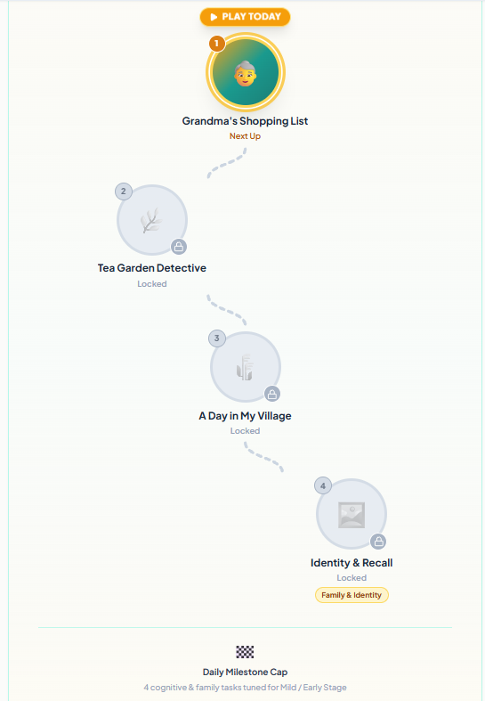
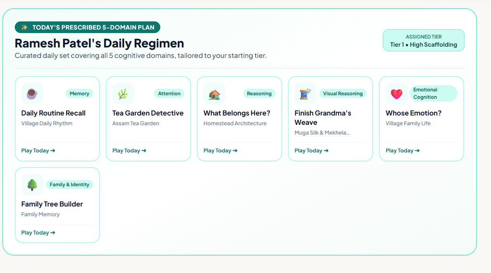
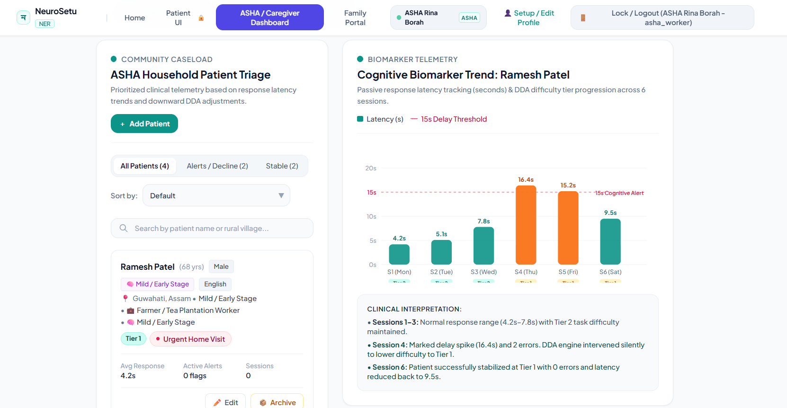
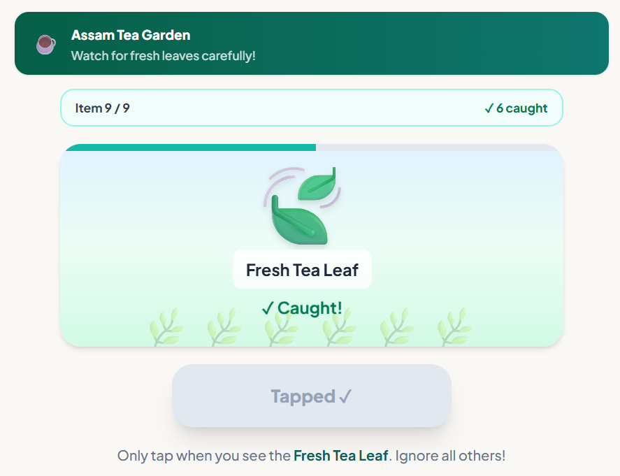
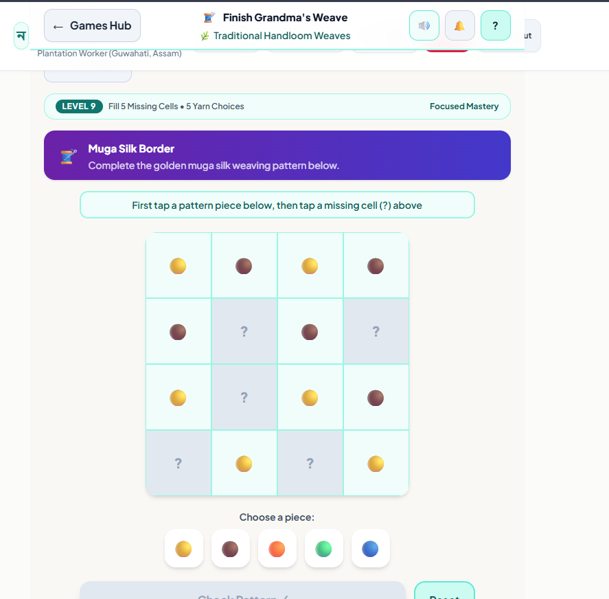
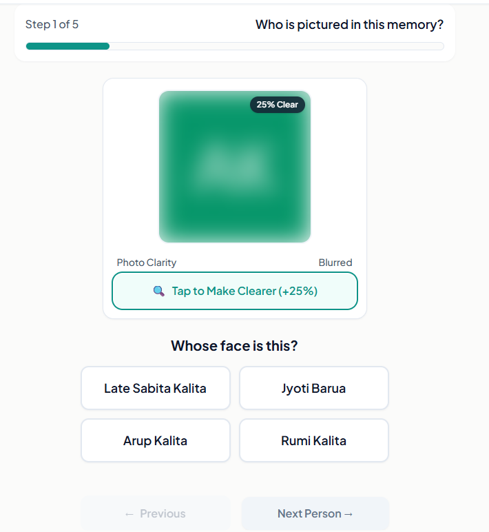

<div align="center">

# 🧠 NeuroSetu

### Cognitive gaming and memory support for elderly dementia care in Northeast India

*Offline-first. Culturally grounded. Built for caregivers, ASHA workers, and patients.*


**[🚀 Live Demo](https://neurosetu-synaptyx.vercel.app/)** · **[📄 PRD](./PRD.md)** · **[🎨 Design](./DESIGN.md)** · **[🛠 Tech Stack](./TECHSTACK.md)** · **[🏗 Architecture](./docs/ARCHITECTURE.md)** · **[🎬 Demo Script](./docs/DEMO_SCRIPT.md)**

</div>

---

## 📌 The Problem

**Smart India Hackathon 2026 · PS 26003 · AI-Based Cognitive and Memory Assistance Platform for Elderly Dementia Patients in North Eastern Region (NER)**

Dementia and mild cognitive impairment are underdiagnosed across Northeast India. Specialists are far away. Connectivity is patchy. Most digital cognitive tools assume fast internet, English literacy, and Western cultural references. Families and frontline ASHA workers are left without simple tools to engage patients or track decline.

## 💡 Our Solution

NeuroSetu is a Progressive Web App that turns daily cognitive exercise into a familiar, culturally rooted routine. It is built offline-first, so core gameplay keeps working with poor or no connectivity. Patients play short adaptive games. Caregivers and ASHA workers see progress and stay connected.

| For | What NeuroSetu gives |
|---|---|
| 👵 **Patients** | Simple PIN login, a visual roadmap, and short daily games that adapt to their level |
| 👨‍👩‍👧 **Caregivers and family** | A family portal where photos can be uploaded to support memory games and stay involved in the patient's routine |
| 🩺 **ASHA workers** | A content manager and patient overview to assign cognitive domains and region packs |

---

## ✨ Features

- 🔐 **Role-based access.** 6-digit PIN for patients, alphanumeric login for ASHA and caregiver staff.
- 🎮 **15 cognitive games** spanning multiple cognitive domains.
- 📈 **10-level adaptive difficulty** across every core game.
- 📅 **Smart daily assignment.** 2 to 5 games per day, scaled to the patient's cognitive stage.
- 🗺️ **Cultural roadmap.** A themed journey with visual node states for progress.
- 🔒 **Gentle idle auto-lock** to protect patient data on shared devices.
- 👪 **Family portal with image upload**, plus family games on a fixed weekly calendar.
- 🗂️ **ASHA content manager** for region packs and cognitive domain assignment.
- 🧑‍🤝‍🧑 **Per-patient data isolation.**
- 🔊 **Voice prompts.** Games read out instructions using Microsoft Edge text-to-speech.
- 📴 **Offline-first.** IndexedDB storage and a Workbox service worker keep the app usable with no connection.

## 🚧 Roadmap

- Click-to-call in the Family and Caregiver Portal
- Multilingual support: Assamese, Bodo, Manipuri, Bengali (Nepali as stretch)
- Bhashini integration for Indian-language voice (API access pending)
- Offline voice fallback using AI4Bharat Indic-TTS
- Cross-game, per-game adaptive personalization
- Weighted cross-domain adaptive scoring heuristic for triage support

> **Note on scoring:** NeuroSetu uses an adaptive algorithm, not a trained ML model. We have no real patient dataset yet, and we chose to be honest about that instead of overclaiming.

---

## 📸 Screenshots

| Patient Roadmap | Festival Memory Match | ASHA Dashboard |
|---|---|---|
|  |  |  |

<details>
<summary>More games</summary>

| Tea Garden Detective | Finish Grandma's Weave | Identity & Recall |
|---|---|---|
|  |  |  |
| *Attention & Focus* | *Visual & Spatial* | *Family games* |

</details>

### 🎮 Game Library

| Domain | Games |
|---|---|
| 🧠 Memory Training (7) | Grandma's Shopping List · Festival Memory Match · Daily Routine Recall · Memory Trail · Remember the Story · Village Path Home · Whose Morning Is It? |
| 👁️ Attention & Focus (2) | Find the Difference · Tea Garden Detective |
| 💡 Reasoning & Planning (4) | What Belongs Here? · Pack the Village Basket · A Day in My Village · Care for Your Companion |
| 🎨 Visual & Spatial (1) | Finish Grandma's Weave |
| ❤️ Emotional Wellbeing (1) | Whose Emotion? |
| 👪 Family Games (4) | Identity & Recall · Category Sorting · Family Tree Builder · Life Story Timeline |

---

## 🏗️ Architecture

```
┌──────────────────────────────────────────────┐
│               React + Vite PWA               │
│  Role-based UI · 15 games · Adaptive engine  │
└───────────────┬──────────────────────────────┘
                │
     ┌──────────┴───────────┐
     ▼                      ▼
┌───────────┐        ┌───────────────┐
│ IndexedDB │◄─sync─►│   Supabase    │
│ (offline) │        │  PostgreSQL   │
└───────────┘        └───────────────┘
     ▲
     │
┌────┴─────────┐
│ Workbox SW   │  caches app shell and assets
└──────────────┘
```

## 🛠 Tech Stack

| Layer | Technology |
|---|---|
| Frontend | React, Vite, Tailwind CSS |
| Offline | IndexedDB, Workbox (Vite PWA) |
| Backend | Supabase (PostgreSQL) |
| Hosting | Vercel |

See [TECHSTACK.md](./TECHSTACK.md) for details.

---

## 🚀 Getting Started

```bash
# 1. Clone
git clone https://github.com/Roshni-07/NeuroSetu.git
cd NeuroSetu

# 2. Install
npm install

# 3. Configure environment
cp .env.example .env
# fill in your Supabase URL and anon key

# 4. Run
npm run dev
```

Build for production: `npm run build`

## 🔑 Demo Credentials

| Role | Login | PIN / Password |
|---|---|---|
| Patient 1 | PIN only | `100100` |
| Patient 2 | PIN only | `200200` |
| Patient 3 | PIN only | `300300` |
| Patient 4 | PIN only | `400400` |
| Caregiver | `caregiver` | `caregiver123` |
| ASHA / Admin | `admin` | `asha123` |

> Demo data only. No real patient information is stored.

---

## 👥 Team Synaptyx

| Name | Contribution |
|---|---|
| **Sharvesh B** | Team leader. Frontend and UI support, voice integration |
| **Roshni Barui** | Frontend lead: UI/UX, roadmap, portals, game fixes |
| **Dhanyashree K P** | Family portal, games, roadmap concept, research, PPT |
| **Anant Mavi** | Backend: Supabase schema and tables, auth, sync, deployment |
| **Bhargavi V K** | PPT across all rounds, diagrams, research |
| **K P Vikas** | PPT, research, coordination with teachers |

*Built collaboratively. Some work was consolidated before being pushed to this repository, so the commit history may not reflect every member's contribution.*

Built for **Smart India Hackathon 2026** · BMS Institute of Technology

---

<div align="center">

*Built with care for the families who care.*

</div>
